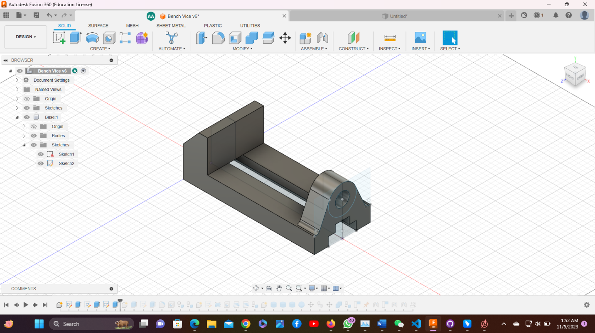
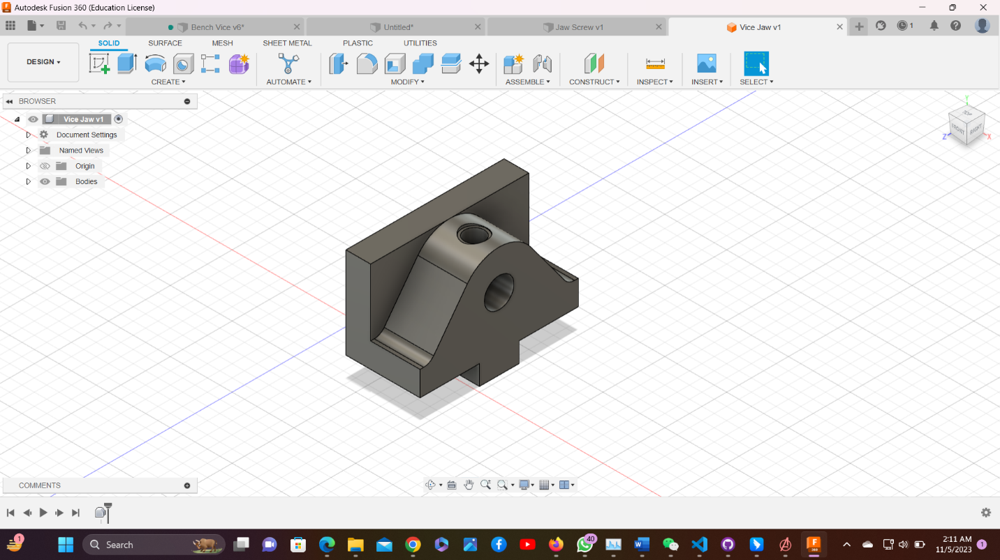
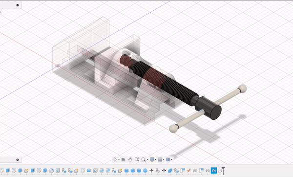
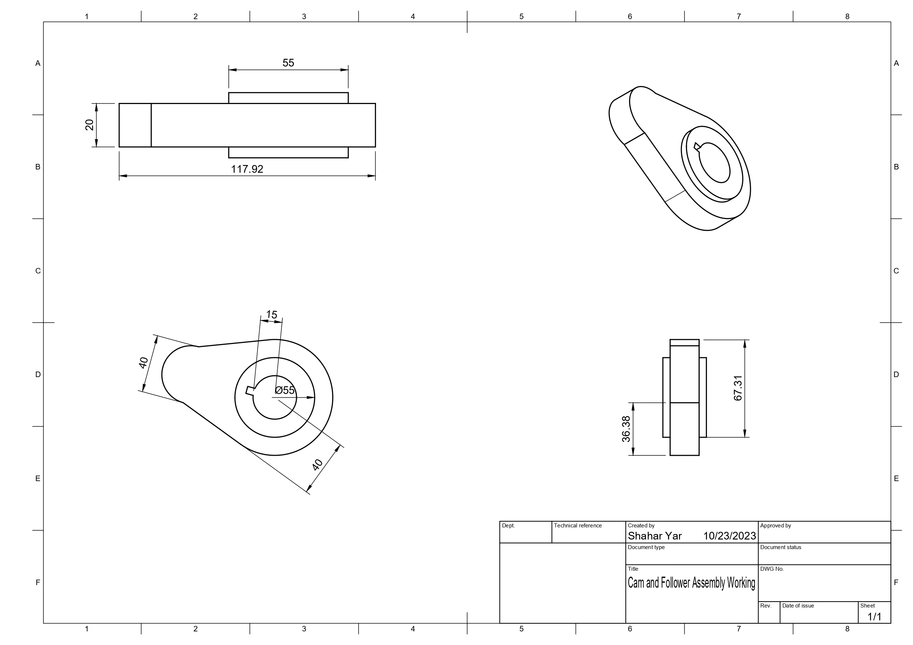

# Fusion 360 Design Project
## **Step 1: Build Design and New Component**

### **1.1 (Bench Vise Assembly)**

This assembly consisting of Four components, here are the components

1.  Base

2.  Vice Jaw

3.  Jaw Screw

4.  Screw Bar

First create a new design by going to file select new design.

Go to documents setting and change the units to millimeter.

### **1.2 Assemble Section (New Component)**

-   In assemble section create a new component and give it a name Base.

## **Step 2: Design 3D Model**

### **2.1 Solid (Create)**

-   In create section create a new sketch on the front plane with
    required dimensions.

-   After Create Sketch click on Finish Sketch and then Use Extrude
    Command

### **2.2 Construct Section (Tangent) & Modify (Fillet)**

-   We have used tangent tool to tangent the Circles which we created
    with circle tool in Create Section.

-   And we have used fillet feature which is present in Modify Section.

-   Now we use line command from create section and then after giving
    dimensions, we use vertical/horizontal tool from Constraints
    Section.

### **2.3 Inspect Section**

-   We use inspect Section to measure the distance between 2 points or
    to measure the angle between 2 points.

### **2.4 Remaining Components**

-   We have designed **Vice Jaw, Jaw Screw** and **Screw Bar**
    respectively.

### **2.5 Assemble**

-   After designing all components, we used joint command in assemble
    section to join all the components.

### **2.6 GIF of Working Condition**

### **2.7 Video of Design History**

<video src="Video1.mp4" controls title="History"></video>

## **Step 3: Motion Link**

### **Vice Jaw**

### **Jaw Screw**

 

### **Screw Bar**

### **Bench Vice Assembly**

### **3D Model Live**

<iframe src="https://myhub.autodesk360.com/ue28cacf9/shares/public/SH512d4QTec90decfa6e29812ef6a85811ad?mode=embed" width="800" height="600" allowfullscreen="true" webkitallowfullscreen="true" mozallowfullscreen="true"  frameborder="0"></iframe>

## **Step 4: Install and Use Plugin**

   - First of all in Fusion 360 go to Utilities and then go to Add-Ins,
    make sure you are connected to the internet.

   - Then you see the option of Fusion 360 App Store, Click on it

-  Now Select your required Plugin and download it.

-  After download install the Plugin.

-  Now again go to Utilities and then in Add-Ins ( Scripts and Add-Ins)
    and go to Add-Ins and select the Plugin you Installed and Use it.

-  And then Click on Run. As i Installed FM Gear so to use this I have
    to go to Create Option and Select FM Gear.

-  Then Give your dimensions and Click on OK. It will Run and Create
    Your Design.

## **Step 5: Engineering Drawing (Vice Jaw)**

## **Step 6: Design Practices**

### **6.1 Design by Arslan Ali**

<iframe src="https://myhub.autodesk360.com/ue28cacf9/shares/public/SH512d4QTec90decfa6e29812ef6a85811ad?mode=embed" width="800" height="600" allowfullscreen="true" webkitallowfullscreen="true" mozallowfullscreen="true"  frameborder="0"></iframe>

### **6.2 Design by Shahar Yar**
#### **6.2.1: Cam and Follower Assembly**
**Working of Model**

**Components of Cam and Follower Assembly**

**Engineering Drawing of Cam**

#### **6.2.2: Hexagonal Nut**

**Engineering Drawing**

.jpg>)

### **6.3 Design by Sana**

<iframe src="https://myhub.autodesk360.com/ue28cacf9/shares/public/SH512d4QTec90decfa6e5299e15e67c6c785?mode=embed" width="800" height="600" allowfullscreen="true" webkitallowfullscreen="true" mozallowfullscreen="true"  frameborder="0"></iframe>

### **6.4 Design by Sahle Hagos**

<iframe src="https://myhub.autodesk360.com/ue28cacf9/shares/public/SH512d4QTec90decfa6e42e30dc2aab69ca6?mode=embed" width="800" height="600" allowfullscreen="true" webkitallowfullscreen="true" mozallowfullscreen="true"  frameborder="0"></iframe>

### **6.5 Design by Ahmed Tejan**

<iframe src="https://myhub.autodesk360.com/ue28cacf9/shares/public/SH512d4QTec90decfa6e294a15da7ed4a49d?mode=embed" width="800" height="600" allowfullscreen="true" webkitallowfullscreen="true" mozallowfullscreen="true"  frameborder="0"></iframe>

## **Step 7: Introduction of another CAD Software**
### **AutoCAD** 
AutoCAD is a popular computer-aided design (CAD) software developed by Autodesk. It has been an industry-standard for 2D and 3D design and drafting for many years. AutoCAD is used in various industries, including architecture, engineering, construction, manufacturing, and more. Its versatility, extensive user base, and compatibility with other software make it a valuable tool for professionals in these fields.

Here are some key details about AutoCAD:

**2D and 3D Design**

  AutoCAD is used for both 2D and 3D design. It's well-known for its 2D drafting capabilities, which allow you to create precise technical drawings, floor plans, schematics, and more. It also supports 3D modeling, enabling the creation of 3D models and visualizations.

**User Interface**

AutoCAD has a user-friendly interface with a familiar ribbon-style toolbar. It provides a wide range of tools and commands for drawing, editing, dimensioning, and annotating drawings.

**Parametric Design**

While not as robust as some other 3D CAD software like SolidWorks, AutoCAD offers some parametric modeling capabilities. You can create and control geometric relationships between objects.

**Libraries and Templates**

 AutoCAD provides libraries of pre-built objects, blocks, symbols, and templates, which can save time and maintain consistency in design projects.

**Customization**

 AutoCAD is highly customizable. Users can create custom commands, menus, and tool palettes to streamline their workflow. It also supports the development of custom AutoLISP and Visual Basic for Applications (VBA) scripts.

**Automation and Batch Processing**

AutoCAD allows you to automate repetitive tasks and batch-process multiple files using scripting and programming, which can significantly improve productivity.

**Collaboration**

AutoCAD offers cloud-based collaboration tools that allow teams to work on the same project simultaneously, even if they are located in different places.

**File Compatibility**

AutoCAD files are widely compatible with other CAD software and can import/export various file formats, making it easier to work with clients and collaborators who use different software.

**Industry Specialization**

AutoCAD has industry-specific versions, such as AutoCAD Architecture, AutoCAD Civil 3D, and AutoCAD Electrical, which include specialized tools and features tailored to specific fields like architecture, civil engineering, and electrical design.

**Mobile and Web Apps**

 Autodesk offers AutoCAD mobile and web apps, allowing users to view and edit AutoCAD drawings on smartphones, tablets, and web browsers, which can be useful for on-the-go access and collaboration.

**Education and Training:**

 AutoCAD is widely used in educational institutions, and Autodesk provides educational versions for students and teachers. There is a vast amount of training material and certification programs available.

